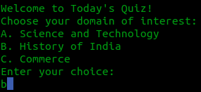

# Quiz-Game
A simple quiz game built using Python

## How to play
Start the game running the `question.py` file.
``` bash
python question.py
```

To choose an alternative, just enter the corresponding letter. It doesn't matter if is upper or lower.



Each question carries 5 points and wrong anwser leads to -1 marks per question